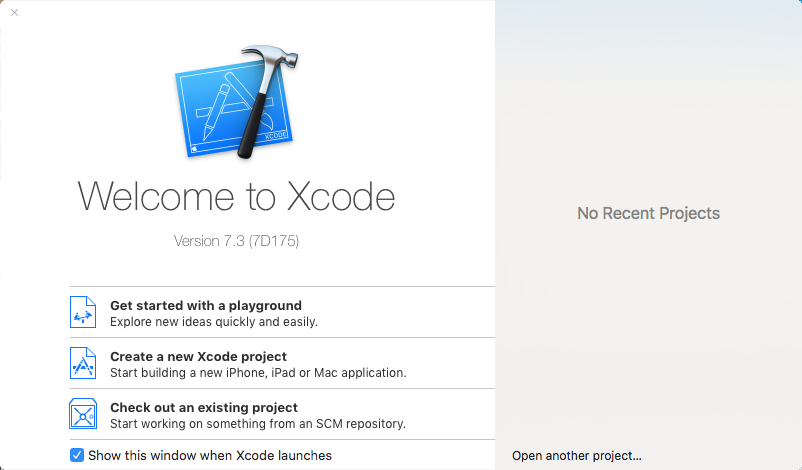

# 第1章 小试牛刀 - Xcode初体验

> ***忆往初,谈笑中多少情仇恩怨;道不尽,生死间几许红尘缱绻。***

世人常言,人在江湖,身不由己。但江湖之外何尝能体会到江湖中人的快乐?正有这样 一位少年良辰,年方弱冠,便毅然决然地踏入了编程江湖。年少之志,意气风发,欲挥斥方遒。试问哪位初入编程江湖之人的梦想或一生浪迹天涯,或成就一番功名,随后有朝一日其风流往事在某个小茶馆被小老儿这般人物评说。诸君可是这样认为的?

初入江湖,首先就是要有一把趁手的兵器,恰逢苹果帮新推出了 Swift 这样一门简单、 强大的内功心法,极大地降低了入门的难度,于是良辰便决心踏上了修炼 Xcode 之路。经过 一番打听,他来到了岚风谷......

## 1.1 下载 Xcode

九月叶下，岚风谷。一位执剑侠客正立于少年面前,默然片刻,云:


既然你已拜入我帮门下,从今天起,就由我来教导你。看样子你已经初步掌握了 Swift 这门内功,不过,掌握了内功并不意味着你能够成为一名真正的编程侠客。试想,空有一身内力,没有武器,没有功法,很可能你连一只鸡都杀不了。因此, 你就必须要牢牢掌握好 Xcode 这个极其有用的法宝,这也是本帮推荐帮众使用的唯一一件法宝。有了它,你才可能成为一名仗剑天涯的编程侠客。

你首先检查一下自己的身体素质吧!要掌握 Xcode 这件法宝,还是有硬性要求的。如果根基不足,强行使用,轻则不成大器,重则伤筋断骨,有性命之忧。如果根骨不行,那就选择早一些版本的 Xcode 来使用。

> Xcode 7.3 目前要求：
> * Xcode 7.3 需要运行在 OS X Yosemite(10.10.5) 及其以上版本
> * 硬盘至少余留 8G 以上的硬盘空间，当然越多越好
> * 至少需要 4G 以上内存，才能够比较流畅地运行 Xcode
> * 如果您正在使用 OS X Mavericks(10.10.9) 或者更老的版本 ，请考虑升级到最新的 El Capitan 以获取更加优秀的体验，或者使用 Xcode 6 或者更早的版本
> * Xcode 7 最低支持 OS X Tiger(10.4)、iOS 6.0、watchOS 1 以及 tvOS1 版本的 SDK。如果您打算使用更早版本的 SDK，请使用装有旧系统以及老版本的 Xcode 的 Mac，您或许会考虑尝试将这些 SDK 直接放入到 Xcode 7 当中，但是很遗憾这个操作基本是无法成功的，因为它们对应的编译器以及运行时都不再被支持

Xcode 这件法宝则能够帮助像你这样的“江湖菜鸟”迅速成长为“编程侠客”，它是一个十分强大的工具，而且自身集成了许多好用、强大的武器，如何完全掌握这些武器，就是你今后所需要下苦功进行学习的。那么对于你来说，应该从哪儿搞到 Xcode 这件威力十足的法宝呢？

最好的办法就是前往我帮专门设立的 Mac App Store 当中购买，我帮要求购买 Xcode 的人必须拥有其 Apple ID，以证明其身份。当然，它是完全免费的。不过在等待入手的过程当中你可以去找个地喝杯茶，因为 Xcode 太大了，从总部调配过来需要很长时间。有些时候，由于某些原因，苹果官方的押运速度会非常的慢，这点你可能清楚。

如果觉得押运速度过于缓慢的话，还可以下载我帮官方提供的 [.dmg 文件]( https://developer.apple.com/downloads/)进行安装。

> **警告**
>
> 2015年9月，国内爆出 “`XcodeGhost`” 事件，这是一种第三方病毒感染方式，主要通过非官方下载的 Xcode 传播，能够在开发过程中通过 CoreService 库文件进行传染，使编译出的 App 被注入第三方代码，向指定服务器上传用户数据。因此，我们不推荐大家使用第三方下载的方式。

## 1.2 苹果开发者计划

可以说，当你开始使用 Xcode 的时候，就可以称呼自己为“苹果开发者”了，这也正是外界对于我帮帮众所给予的称号。不过，我帮并不会为普通帮众给予很多关注，只有交了供奉的帮众，才能成为“精英”，受到我帮的诸多优待。

加入开发者计划的方式可能会发生变化，不过如果你打算加入的话，我可以给你先描绘一个大概。前往[苹果开发者计划网站](https://developer.apple.com/cn/programs/ )，会有专人来指引你加入的。那么问题是，所谓的“优待”都有哪些呢？

* 我帮将会给精英提供最新的开发套件以供尝鲜，包括最新的操作系统和开发套件。
* 能够提供专门的支持服务。如果你在修炼方面遇到了困难，可以去联系我帮，会有大师来为你解答。
* 能够发布应用，意味着你就能够在苹果帮的官方商店里面销售各种东西。

目前，我帮的开发者计划面向于所有的苹果平台设备，包括 iPhone、iPad、iPod、Mac、Apple Watch 和 Apple TV，也就是说，加入了开发者计划，就能够在 App Store 里面分发 App 了，包括 iOS 上的 App Store、Mac 上的 Mac App Store，以及 AppleTV 上的 App Store。此外，Safari 扩展的分发权限也包含在里面。

稍安勿躁，看得出来你很关注其价格。我帮给出的价格仍然符合“高大上”情怀——688RMB，一年。没错，不要 998，只要 688，开发者计划带回家。

因此，你在考虑加入开发者计划之前，为何不先将 Xcode 练习到炉火纯青？这样就不会浪费手中的大洋了，当然如果你觉得自己财大气粗的话，就当我没说这句话。

当你在选择开发者计划的时候，要注意是选择以个人的身份还是以公司的身份发布应用。如果是后者，那么还需要向我帮提交一系列的文档证明才能完成申请，比如说法人实体名称和 D-U-N-S 码等等。具体的操作，在此我就不再赘述了，我帮对此有着详细的指南。

## 1.3 欢迎界面

就先让你一睹 Xcode 的风采吧。如你所见，Xcode 的表体是一张蓝色的卷轴，上面有一把精致的银锤，这正是代表了我们“开发者”的标志所在。你要记住，我帮的宗旨是，我们“苹果开发者”所制作的东西，都是能让公众受益的，并且，我们都以公众喜爱我们的产品为荣。这种精神，我谓之“天志”，就如轮人之有规，匠人之有矩。好的，毋需多言，让我们打开它来一探究竟，首先出现的是 Xcode 的欢迎界面，如图 1-1 所示：



界面的左侧有三个选项，这是用来建立和导入项目的，第一个是使用 playground 来开始项目，它能够帮助我们实现最新、最炫的想法；第二个是创建 Xcode 项目，这也是正常情况下创建项目开始的地方；第三个是从代码库下载代码，可以从代码库中直接下载到本地的 Xcode 中来进行运行或修改，往往用于版本管理和多人协作。

界面右侧是项目列表，上面列举了最近使用过的项目，方便快速打开常用的项目。如果要打开的项目不在这个列表里面，那么可以点击列表最下方的 `Open another project…` 来打开项目。

如果不想再看到这个欢迎界面的话，那么就把最下方的 `Show this windows when Xcode launches` 的复选框取消掉，这样再打开Xcode的时候欢迎界面就不会再出现了。

若要再次打开 Xcode 欢迎界面，那么依次选择菜单栏上的 `Window -> Welcome to Xcode` 即可，或者直接使用 `Command + Shift + 1` 快捷键。

## 1.4 认识 Playground

什么是 Playground？我更愿意称呼其为“训练场”。在这里，可以尽情地使用 Swift 这门功法来施展各式各样的招式，既可以用来练习 Swift，也可以用来实现某个功能然后将其融合到产品当中，还可以设计某一个算法然后观察它的显示结果。可以说，“训练场”让 Swift 展示了某些脚本语言的特性。图 1-2 显示了“训练场”的模样：

> 提示：
>
> 实际上，Playground 只是提供了一个可实时编译运行并展示的交互式开发环境而已，类似于著名的 REPL。因此，Swift 并不是一门解释型语言，仍然还是一门编译型语言，这项功能完全借助于强大的 LLVM 编译器的能力。不过，目前 Playground 仅仅只支持 Swift 语言，但是国外开发者 Krzysztof Zabłocki 开发出了一个可以运行 Objective-C 语言的 Playground，感兴趣的读者可以前往他的 [Github](https://github.com/ krzysztofzablocki/KZPlayground) 上下载。

在界面的右侧区域，可以实时地看到常量、变量的值、打印的内容以及循环次数等等，这就是所谓的代码版的“所见即所得”。

将鼠标指向 Playground 中所显示出来的值，便可以看到界面右侧出现了一只小眼睛和一个白色的圆圈，如图所示。点击小眼睛，也就是所谓的 `Quick Look`（快速查看），就可以快速查看其完整的值。如图 1-2 所示，点击“快速查看”之后，从小眼睛的部位弹出了一个小对话框，对话框里面显示了该变量（常量或者结果）的值。


点击白色的圆圈，也就是所谓的 `Show Result`（显示结果）就可以将对话框中显示的结果值嵌入到代码片段里面，如图 1-3 所示。这个功能大大地提升了 Playground 的可视化程度，变得更加有意思了。我们也可以再次点击白色圆圈，就可以将这个结果框从代码中移除了。

> 提示：
>
> 在 Xcode 6 的 Playground 当中，还可以在结果框的左上角点击”x”按钮关闭该结果框。


这里我们实现了一个循环次数为 100 次的循环结构，每次循环，`i` 的值就自增 1，然后用变量 `num` 来显示和记录这个值。单击快速查看或者是显示结果按钮，就会看到一个蓝色的“一次函数”，如图1-4所示。


这个是以时间为横坐标轴显示的图形，主要是显示在循环体当中，借助这个功能，可以轻松查看在循环过程中，变量值的变化情况。Xcode 6 中，在这个结果框的右上角还存在三个按钮，分别是让其显示图表（Gragh），还是显示当前值（Current Value），亦或者是显示全部的值，如图1-5所示。


对于 Xcode 7 来说，这个选项变成了在结果框处点击右键，在弹出的对话框中选择结果该如何显示，如图1-6所示。


对于 Xcode 6 来说，Playground 的下方默认是时间控制栏，通过它可以调整当前时间，只要是对受时间控制的函数、方法体有效。右下角则是指定 Playground 运行最高层（top-level）代码的时间。

在 Xcode 7 中取而代之的是另外两个东西，分别是控制台显示和 Playground 运行控制选项。Playground 运行控制选项可以选择停止和开始 Playground 的运行。至于时间控制栏，则需要其他的方法打开。

总之，Playground 是一个很有意思的东西，用它来练习 Swift 是再好不过的了，不过 Playground 仍然有它的限制，比如说 Playground 无法释放内存、性能受到极大的限制等等问题。关于 Playground 的更多内容，我们将在未来的章节中对其专门进行介绍。

## 1.5 创建项目

好了，是时候离开“训练场”了，现在我们要创建第一个项目了。

（1）单击 `Create a new Xcode project`，这时弹出一个“项目模板”选择窗口，如图 1-7 所示。有关“项目模板”的详细说明，请参阅本书的附录C.2“项目模板”。这里我们选择 `Mac` > `Application` > `Command Line Tool` 命令行工具模板，然后输入项目名称 (Product Name)、组织名称 (Organization Name) 以及组织标识符 (Organization Identifier)。


要注意的是，这里不推荐用数字作为项目名称的首字符，也不推荐使用特殊字符来命名项目名称和组织标识符。因为如果这样做的话，那么下面的包标识符（Bundle Identifier）就会用 `-` 来代替不符合规范的字符，这可能会给应用上传带来麻烦，因此我不推荐你这样做。

组织标识符和包标志符都是用来唯一确定应用身份的标识符，一经创建后最好就不要修改，否则可能会带来麻烦。如图1-8所示。


语言有四种可以进行选择，分别是 Swift、Objective-C、C++ 和 C，你可以选择自己熟悉的编程语言进行下一步的操作，如果你使用的是 Swift 这门语言,那么在这里就选择 Swift。

（2）单击 `Next`，选择存储项目文件的路径。注意,下面勾选了 `Create Git repository on` 的版本管理选项,这可以让源代码使用 git 来进行版本控制。有关版本控制的相关内容请 参阅本书的第 19 章。这里我们先不勾选。

（3）最后单击 `Create` 完成项目创建，创建完的界面如图 1-9 所示。


创建完成后，映入眼帘的便是“项目设置”页面，其中包含了 Resource Tags、Build Settings、Build Phases 和 Build Rules四个设置项。

* **Resource Tags**： 资源标签，每个标签由标题和资源列表组成。标签主要用来区分和管理按需加载资源 (On-Demand Resources)，这个是 Xcode 7 提供的新特性，在之前的版本上是没有这个选项的。

* **Build Settings**： 编译设置，每个选项由标题 (Title) 和定义 (Definition) 组成。这里主要定义了 Xcode 在编译项目时的一些具体配置。

* **Build Phases**: 编译资源，用于指定编译过程中，项目所链接的源文件、依赖对象、库、图片等等资源，也可以用于复制文件、运行脚本等等辅助编译动作。

* **Build Rules**: 编译规则，决定编译过程中每一个文件要如何处理。由文件类型和处理动作组成。

关于项目设置的详细内容，请参阅本书的 3.2 节“对象管理”。至于如何配置这些项目设置，就不在我们的介绍范围内了，请自行查阅本帮提供的相关文献吧！

## 1.6 Hello world

打开 `Main.swift` 文件,可以看到,示例程序中已经为我们添加了如下的 “Hello, World!” 语句:

```Swift
import Foundation

print("Hello, World!")
```

如果你选择 Objective-C,示例程序“main.m”是这个样子的:

```ObjC
#import <Foundation/Foundation.h>

int main(int argc, const char * argv[]) {
    @autoreleasepool {
    // insert code here...
    NSLog(@"Hello, World!");
    }   
    return 0; 
}
```

如果你选择 C++,示例程序“main.cpp”是这个样子的:

```C++
#include <iostream>

int main(int argc, const char * argv[]) {
    // insert code here...
    std::cout << "Hello, World!\n";
    return 0; 
}
```

如果你选择 C,示例程序“main.c”是这个样子的:

```C
#include <stdio.h>

int main(int argc, const char * argv[]) {
    // insert code here...
    printf("Hello, World!\n");
    return 0;
}
```

如果对文件进行了修改，那么页面的最上方便会出现 `Edited` 标识，并且文件的图标会变成灰色，如图1-10所示。


> 提示：
>
> 提示：如果使用的是 OS X Yosemite 之后的系统，那么您将无法看到所谓的 `Edited` 标识。

要保存对文件所进行的更改的话，请依次点击 `File` > `Save`，便可以对文件进行保存，也可以使用快捷键 `Command + S` 快速保存。

## 1.7 生成并运行应用

完成了更改之后,就可以运行应用了!点击主界面左上角的三角形按钮,程序便可以运 行了。或者依次点击 `Product` > `Run`,也可以使用快捷键 `Command + R` 快速运行。

运行成功后，你会看到 Xcode 弹出了一个一闪即逝的提示框,提示 “Build Succeeded”, 即编译成功，如图 1-11 所示。


运行后的效果如图 1-12 所示,可以看到，“Hello, World!”出现在了“控制台”里面。


如果没有出现控制台窗口,那么依次点击 `View` > `Debug Area` > `Activate Console` 打开调试区域,或者直接使用快捷键 `Command + Shift + C` 打开。

## 1.8 移除项目

移除项目的方式很简单，直接找到项目所在的位置直接将其删除，但是这种方式会在 Xcode 中留下些许残留。如果没有强迫症的话完全就可以不必在意这些细节，不过有些时候还是清除为妙。

依次点击 `Window` > `Projects`，打开项目管理窗口，然后选中刚刚删除的项目（被删除掉的项目颜色是红色的），然后按下 `delete` 键，或者选中左下角的齿轮，选择 `Remove from Projects` 选项，这样这些缓存文件便灰飞烟灭了。如图 1-13 所示。


通过今天的学习，相信你也对 Xcode 的使用略有感悟了。现在，你可以称得上是入门了，不过离出师的标准还差得远呢！任重而道远，你回去之后要多加勤学苦练，熟能生巧，方能大有可为啊！

说完，只听这名侠客大笑数声，一阵疾风略过，已不见了身影。远方，传来侠客的吟唱：

***“凌波逐朔风，步云踏飞鸿。彩云应日起，执剑对长空。”***

夕阳渐下，少年静静地注视着侠客远去的身影，缓缓消逝在了无垠的地平线下。四周万籁俱寂，空余少年孑然一人，伴着他的，唯有一影、一剑、一卷轴而已。