# 第二章 纵观全局 - 布局探索

***暮秋岚风残月起,叶落肩头影相顾。男儿未遂平生志,蓝卷银锤绘新说。*** 

《孙子兵法》有云:知己知彼,百战不殆,故了解自己手中的法宝,是每一位苹果帮众的 必经之路。正所谓人剑合一,试想,若一个武者不能掌握其手中之器,那么在战场上,何谈杀敌?不把自己击伤,就可要谢天谢地咯!诸君以为然也?

于是,与其师短暂分别之后,良辰便开始仔细探索起法宝的构造来,先囫囵个大概,做到知其然。随着良辰的学习不断深入,法宝与他的联系开始逐渐强了起来......

## 2.1 工作区

Xcode 的工作区是用来执行核心开发任务的区域,它是创建和管理项目的主要界面。项目(Project)是 Xcode 开发的主要单元,包含了构建产品所需的所有元素(源代码文件、资源 文件等)、框架、插件等,并且工作区还用以维护这些元素之间的关系。

Xcode 的工作区可以根据其中项目的特性而自动适应,根据选择文件、对象的不同而打 开不同的窗口。当然,Xcode 还提供了自定义工作区风格的功能,以便工作区能够更加符合开 发者的习惯。有关自定义工作区的相关信息,请参阅本书附录 A 中的 A.3 节“Xcode 设置”。

打开项目(Project),就会立即弹出工作区的窗口,其界面基本上如图 2-1 所示。

工作区的窗口界面中央是编辑器区域,通常情况下的代码编写都是在这个区域完成的。一旦选中了项目中的一个文件,其内容便会出现在编辑器区域。Xcode 会自动识别文件类型,并使用相应的编辑器来打开这个文件。

比如说图 2-1 中,在工作区窗口的左侧导航器区域中,选中了一个 Swift 代码文件,中间 的编辑器区域显示的就是 Ball.swift 文件的内容。与其他区域不同的是,编辑器区域可以出现 多个,甚至可以单独以一个窗口的形式出现。

## 2.2 工具栏

工作区窗口顶部的工具栏可以让你快速访问频繁使用的命令,如图 2-2 所示。运行按钮可以直接编译和运行你的产品。停止按钮可以立即中止运行。方案选择菜单可以让你选择想要创建和运行的产品,关于方案选择菜单的相关介绍,请参考本书的 10.1 节“编译方案”。

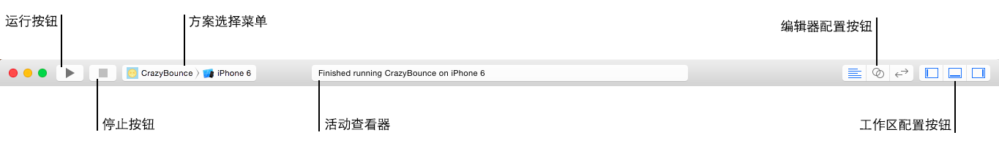

活动查看器位于工具栏正中央,通过展示状态信息来展示当前任务执行的进程、编译进 程以及项目的其他信息。

当有很多进程在同步进行时,活动查看器会在这些进程中轮流切换(就像横幅广告一样),并且在其左侧显示出并行任务的数量。单击这个数字,就可以显示一个列出所有当前进程及 其进度的弹出框。

如果出现任何错误或者警告,问题的数量也将会显示在活动查看器当中。单击这个问题计数,就可以切换到问题导航器,以便查找和修改问题。

“编辑器配置按钮”则可以根据既定的任务来配置编辑区域。关于编辑器的详细内容,请参阅本书的 2.5 节“编辑器区域”。

Xcode 的工作区被横向分为了 3个主要的区域,它们肩并肩组成了 Xcode 的界面。这些 区域用来执行开发周期中不同的任务,隐藏不用的区域可以让你更好地专注于当前的任务。你可以通过工具栏最右端的“工作区配置按钮”来隐藏或者展示这些区域。

* **显示 / 隐藏导航器区域(navigator area)**:你可以在导航器区域中浏览整个项目的内 容,包括其中的文件、断点、测试报告等,也可以执行一些搜索功能。详细内容参见 本章 2.3 节“导航器区域”。

* **显示 / 隐藏调试区域(debug area)**:你可以在调试区域查看正在运行项目中存在的变 量、使用控制台与调试终端进行交互以及控制应用程序的执行。详细内容参见本章 2.6 节“调试区域”。

* **显示 / 隐藏工具区域(utilities area)**:你可以在工具区域检查或者更改元素的属性,也可以访问现成的资源库。详细内容参见本章 2.7 节“工具区域”。

使用菜单栏的 View → Hide/Show Toolbar 可以显示和隐藏工具栏。

## 2.3 导航器区域

导航器区域可以用来访问项目中的文件、符号、单元测试、测试诊断以及其他方面的内容,总而言之,项目中绝大多数元素都存放在此处。通过在导航器顶端的“导航栏”,选择当前所需的导航器,以执行所需的操作和任务。

导航栏中,可以选择 8 种导航器,下面分别介绍。 

### 2.3.1 项目导航器

项目导航器(Project navigator)可以用来检索项目的源代码和资源文件,它统一显示了项 目中文件夹的目录层级关系以及元素名称,如图 2-3 所示。

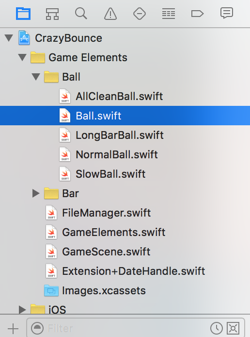

项目导航器是开发过程中最常用的导航器,在其中选中某个元素,就会在编辑器区域中用合适的编辑器将其打开、显示出来。与 Finder 类似,开发者可以添加、删除和重命名项目导航器当中的资源。有关项目管理的相关内容,请参阅 3.1 节“文件管理”。

导航器底部有一个过滤器栏,可以让开发者过滤项目列表中的元素。

过滤器栏中时钟样式的按钮将只显示最近修改过的文件。

小正方形(OS X 10.10 以前的版本中这更像一个小抽屉)按钮将只显示能使用版本管理的文件。

左边的“ + ”按钮用来在项目中添加新的文件、项目和资源。 

### 2.3.2 符号导航器

符号导航器(Symbol navigator)用于显示代码中的类、对象、函数、变量、属性等元素 信息,这些元素统称为“符号”。符号导航器如图 2-4 所示。

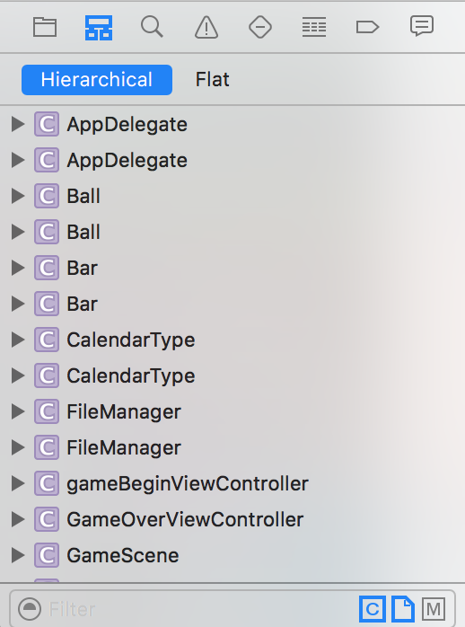

开发者可以更改符号导航器的显示方式,包括分层(Hierar-chical)显示和平坦(Flat)显示。分层显示将会按照类的层级来显示符号,子类将会包含在父类当中;而平坦显示则会将全部类显示出来,无所谓类的层级。

符号导航器中所显示出来的符号前面都有一个特殊的图标,用于表示符号元素的种类, 如表 2-1 所示。

##### 表2-1 符号元素的图标

| 图标 | 符号 | 图标 | 符号 |
| :--: | :--: | :--: | :--: |
|  | 类(Class) |  | 结构体(Struct) |
|  | 协议(Protocol) |  | 联合体(Union) |
|  | 函数(Function) |  | 类型定义(Typedef) |
|  | 全局变量(Global Variable)  |  | 方法(Method) |
|  | 枚举(Enum) |  | 属性(Property) |
|  | 枚举成员(Case) | |

导航器底部的过滤器导航栏提供了多个列表过滤选项。

第一个过滤按钮(正方形括起来的 C)用以选择是只显示类和方法,还是显示全部类型的 符号(比如协议、结构、枚举等)。如果选择显示全部类型的符号的话,符号导航栏将会按照 类型来进行分组。

第二个过滤按钮(折起来的文件夹)则是用以选择是否只显示本地项目中所定义的符号。取消选中之后,符号导航栏将会检索所有当前项目所导入的其他项目、框架中定义中的符号,然后将会显示有多少是来自于本地项目,有多少是来自于系统。

第三个过滤按钮(正方形括起来的 M)用来指定给定符号的成员(比如类的成员)是否显示。

### 2.3.3 搜索导航器

搜索导航器(Find navigator)用来显示搜索结果和选择搜索方式,如图 2-5 所示。有关搜 索导航器的更多内容,请参阅 7.7.2 节。

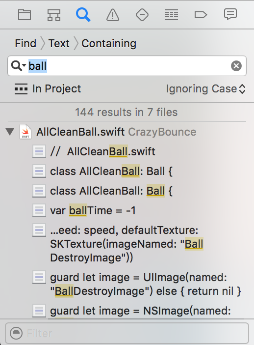

			
### 2.3.4 事件导航器

事件导航器(Issue navigator)用来显示在工作区找到的任何“事件”,诸如编译错误、语法错误、库链接异常,以及错误提示等信息,如图 2-6 所示。通过这个导航器可以快速有效地查看出现问题的文件对象,方便开发者进行更正和修改。

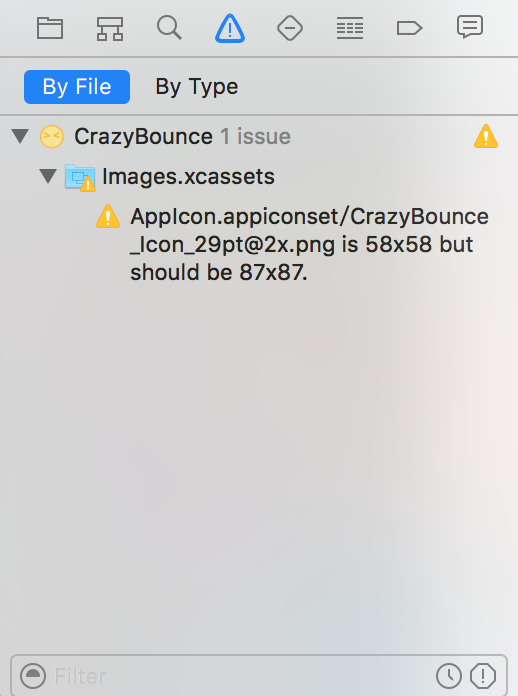

事件导航器可以选择将事件按照文件分类(By File),还可以选择按照问题类型分类(By Type)。

底部的过滤器导航栏提供了多个列表过滤选项。
第一个过滤按钮(时钟)用来选择是否只显示最后一次编译中所发现的问题,也就是只显 示“新”问题。当然,仅限于警告。

第二个过滤按钮(惊叹号)用来选择是否只显示错误信息,而隐藏警告的出现。

### 2.3.5 测试导航器

测试导航器(Test navigator)用来显示单元测试用例以及测试结果,还可以快速执行单元 测试,如图 2-7 所示。关于测试导航器的相关内容,请查阅第 12 章。

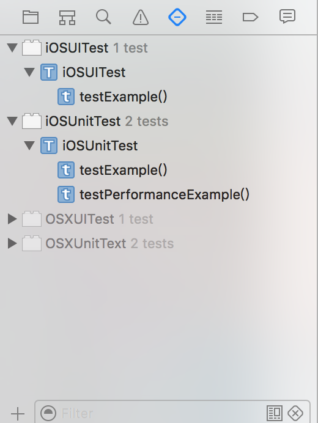

### 2.3.6 调试导航器

调试导航器(Debug navigator)用来显示应用程序在调试状态下的资源占用状态以及堆 栈信息,如图 2-8 所示。关于调试导航器的相关内容,请查阅本书的第 11 章“谨防走火入 魔— 调试”。

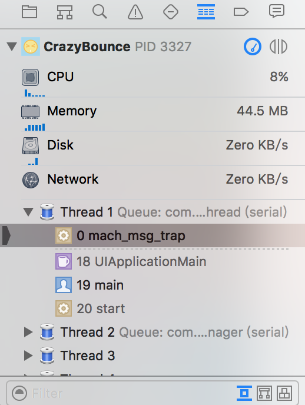

### 2.3.7 断点导航器

断点导航器(Breakpoint navigator)用来显示应用程序中所标记的所有断点信息,如图 2-9 所示。关于断点导航器的相关内容,请查阅第 11 章。

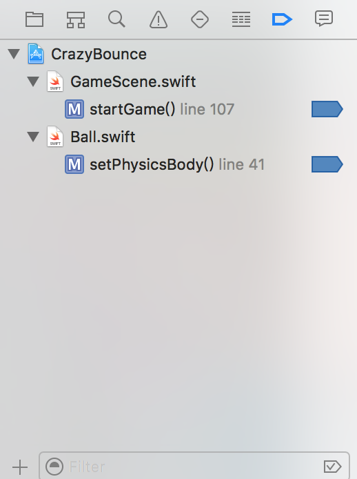

### 2.3.8 日志导航器

日志导航器(Report navigator)用来显示所有的日志信息,包括编译、分析、测试和调 试方面的有关日志,如图 2-10 所示。

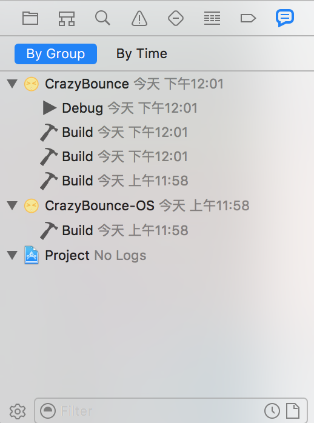

日志导航器可以选择将日志按照项目分类(By Group),还 可以选择按照事件分类(By Time)。

当开发者选中其中一个运行日志之后,编辑器区域将会显 示对应的运行日志信息。开发者可以在编辑器区域中查看编译 的过程步骤,然后查看出错的位置,还可以过滤想要查看的消 息(全部显示,仅显示事件,仅显示错误)。

这个编辑器区域实际上是一个只读的文本区域,开发者可 以按行复制其中的内容。

还可以选择消息右侧的列表图标,显示消息相关的命令和 输出。

底部的过滤器导航栏提供了多个列表过滤选项和操作 选项。

第一个小齿轮图标是操作按钮,用来创建“机关”。

第二个时钟图标是过滤按钮,用来控制是否只显示最后一次操作之后所产生的日志。

第三个文件图标是过滤按钮,用来选择是否只显示连续集成操作的日志信息。

## 2.4 跳转栏

在每个编辑器以及辅助编辑器面板顶部都包含有一个跳转栏,这是一个交互式的分层机 制,用以显示当前编辑器在项目组织结构中所处的位置,还可以直接跳转至项目中任意层次 结构中的某个项目,如图 2-11 所示。

跳转栏可以作为项目导航器的一个替代品,在项目导航器被隐藏的时候,可以用它来代 替项目导航器来切换不同的文件。

跳转栏的配置和行为可以根据上下文环境来定制,基本的 跳转栏由三部分组成。

### 2.4.1 相关项目菜单

相关项目菜单提供了与当前上下文环境相关的附加 选项,如图 2-12 所示。每个文件、每个对象的相关项目菜单都不相同，以下是几个常用的相关项目菜单。

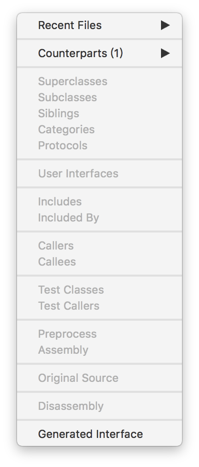

#### 文件级别

* Recent Files:跳转到最近打开的文件。 

* Counterparts :跳转到你正在编辑文件的配对文件,通常指的是执行(.m)文件和头 (.h) 文件。

* User Interfaces :跳转到绑定当前类的用户界面文件 当中,比如 xib 和 storyboard 文件当中，并且可以直接定位到该场景。

* Preprocess :跳转到当前文件预处理之前的状态,通过这个选项可以查看在测试 / 编译 / 运行 / 分发之前,该文件所完整编译的状态。

* Assembly :跳转到当前文件处理之后的状态,该文件会被编译成 LLVM 能够编译运行的汇编语言级别的“装配流水线”。

* Disassembly :跳转到当前文件处理之前的状态,与
Assembly 配套使用,必须在助理编辑器打开,且应用运行并出于调试暂停状态的时候才能显示。

#### 类级别

以下几个类级别的选项可以帮助我们更好地分析类的层级,并且在父类、子类等当中跳转。假设光标现在停留在了一个继承自 UIViewController 的类 ViewController 当中。

* Superclasses :跳转到当前类的父类,Superclasses 将可以把我们引导到 UIViewController 类当中,此外,还可以直接上溯到最终父类 NSObject。

* Subclasses :跳转到当前类的子类,比如在 UIViewController 类中可以跳转到 ViewController 当中。

* Siblings :跳转到当前类的同类,即继承了同一个父类的对象。使用 siblings 可以把 我们引导到 UIAlertController 等多个同样继承 UIViewController 的类当中。

* Categories :跳转到当前的扩展,如果当前这个类被 Category 扩展了功能,那么这 个功能可以引导我们前往这个 Category。

* Protocols :跳转到当前类所实现的协议,比如可以跳转到 UIViewController 所继承 的 NSCoding 协议当中。

### 头文件之间的包含关系

比如当前文件A.m导入了一个头文件A.h: 

* Includes :跳转到当前文件所导入的头文件定义当中,也就是在 A.m 中可以跳转到其所导入的头文件 A.h 中。

* Included By :跳转到导入当前头文件的文件定义当中,也就是在 A.h 中可以跳转到导入它的文件 A.m 中。

### 方法之间的相互调用关系

我们假设比如B方法中调用了A方法:

* Callers :跳转到调用当前方法的方法定义当中,也就是在 A 方法中,使用 Callers可以跳转到 B 中。

* Callees :跳转到当前方法所调用的方法定义当中,也就是在 B 方法中,使用Callees 可以跳转到 A 中。

### 测试之间的相互调用关系

接着是测试方法和测试类之间的相互调用关系,比如说在Test类中有一个test方法, 这个 test 方法调用了一个 check 方法。

* Test Classes :跳转到引用当前测试方法的测试类当中,也就是在 check 方法中可以跳转到 Test 类中。

* Test Callers :跳转到调用当前测试方法的测试方法当中,也就是在 check 方法中可以跳转到 test 方法中。

### Swift 特有的选项

* Original Source :这个选项只能在 Objective-C 和 Swift 共用的项目当中使用,在调用了 Objective-C 方法的 Swift 方法当中,这个选项可以跳转到这个 Objective-C 方法当中。

### Xib 文件

对于xib文件来说,它的相关项目菜单也有所不同,如下所示,见图2-13。

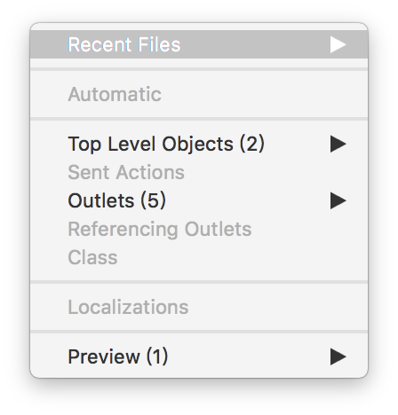

* Automatic:这个选项用来跳转到当前 nib 文件所绑定的类当中。 

* Top Level Objects :顶层对象是没有父类的对象集合,通常情况下包括添加到 nib 文件中的窗体、菜单栏以及自定义的对象。

* Localizations:这个选项用来跳转到当前 nib 文件所对应的本地化版本文件当中,这个选项要开启了本
地化功能才能使用。

* Notification Payloads:这个选项用来跳转到当前 Storyboard 文件的通知载体控件上,需要开启Notification 功能才能使用。

* Preview:结合助理编辑器使用,可以查看 nib 文件在不同尺寸设备上的外观。 

* Sent Actions:查看当前 xib 文件所绑定的 IBAction 方法。

* Outlet:查看当前 xib 文件所绑定的 IBOutlet 属性。

* Referencing Outlets:查看当前 xib 文件所绑定的 IBOutlet 集合属性。 

* Class:查看当前 xib 文件所绑定的类。

#### Storyboard 文件

对于Storyboard文件来说,相关项目菜单则是:

* Timeline :如果 Storyboard 使用了时间线功能,使用这个选项可以跳转到不同的时间线。

当然,对于不同的文件、不同的编辑器、不同的平台来说,其相关项目菜单也不一样,对于本书没有介绍到的项目,读者可以自行查阅相关资料和文档,在此就不加以赘述了。

### 2.4.2 其余部分

* 后退/前进按钮:用来在导航历史中查看上一个或者下一个文件(见图2-11)。

* 分层路径菜单:可以通过这个菜单跳转至一个新项目来更改编辑器或者辅助编辑器面板中展示的内容。根据你点击的路径,它可以由一个或者多个分段组成。点 击分层路径菜单中的某个分段(segment)可看到相关项目的弹出菜单,如图 2-14所示。 

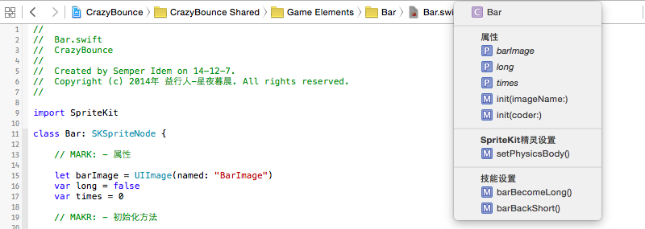

比如,你可以在项目中使用跳转栏导航至某个文件或者打开任何一个文件,也可以使用跳转栏打开文件夹内的文件,还可以在当前打开的文件中使用跳转栏来展示并选中符号。对 于界面构造器文件,可以查看用户界面的层次结果。如果 Xcode 在工作区中发现问题,问题 标记会出现在跳转栏的右边。

## 2.5 编辑器区域

Xcode 中大部分编辑工作都是在编辑器区域进行的,编辑器是动态出现的,适合于当前选择的文件,还可以来回切换编辑器,编辑器有很多种,例如:

* 码编辑器(Source editor):用以编写源代码。
* 界面生成器(Interface Builder):用以图形化地创建和编辑用户界面文件。
* 项目编辑器(Project editor):用以查看和编辑应用程序的编译方式,比如指定编译项、目标架构以及相关信息。
* 数据模型编辑器(Core Data Model editor):用以编辑 Core Data 相关的数据模型。 

除了上面介绍的编辑器之外,Xcode 还含有很多不同形式的编辑器,其他的编辑器会在 今后的章节中有所提及。使用工具栏(参见图 2-2)右侧的编辑器配置按钮,可以根据相应的 需求来配置编辑器区域。下面分别介绍几个编辑器配置按钮。

### 2.5.1 标准编辑器

标准编辑器(Standard editor)  page11image6224显示方式使用选中文件的内容填充编辑区,这种显示方 式是大多数时候所使用的编辑器区域显示方式,这时只能显示唯一一个编辑器区域,以便让 开发者能够专注于使用当前的编辑器。

### 2.5.2 辅助编辑器

辅助编辑器(Assistant editor)  page11image7296显示方式用以在标准编辑器区域中展示一个在逻辑上与 原内容匹配的单独的编辑器面板,如图 2-15 所示。

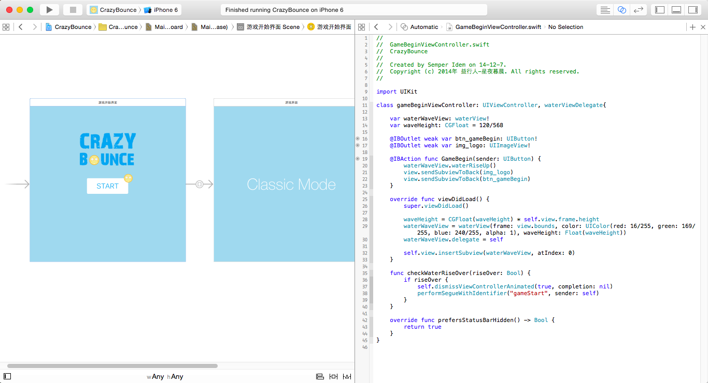

换句话说,辅助编辑器执行的是“拆分窗格”的功能,能够帮助开发者在多个文件中执行一些常见的辅助任务。比如,开发者可以在界面生成器中,将控件和代码连接起来(参见 7.1 节),从而建立动作和输出口链接。

默认情况下,当初始打开辅助编辑器的时候,它执行“匹配”的行为模式是“手动” (Manual),在这个模式中,开发者可以自行选择辅助窗格所显示的内容。当然,开发者还可以使用跳转栏的相关项目菜单,选择合适的编辑器行为模式。

开发者还可以在现有的辅助编辑器的右上角点击“添加”或者“删除”按钮来添加或者移除附加的辅助编辑器。

新添加的辅助编辑器具备自己独立的跳转栏,然后其出现的位置是点击添加按钮的辅助编辑器之后。注意,原先的标准编辑器不具备添加和删除编辑器的功能,也就是说,一般情况下编辑器区域都始终含有一个编辑器存在。

可以用快捷键来打开辅助编辑器。默认情况下,在标准编辑器显示模式下,按下 Option 键并选中项目导航器当中的文件,将会在辅助编辑器中显示选中的文件。而如果是在辅助编辑器视图下使用该快捷键,则是切换辅助编辑器中显示的内容。而如果存在不止一个辅助编辑器,或者按下 Option+Shift 键并选中文件的时候,那么 Xcode 就会弹出一个直观的位置选择器,来询问开发者要在哪个编辑器中显示这个文件,如图 2-16 所示。

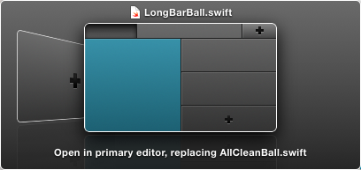

此外,开发者还可以更改辅助编辑器的布局,通过标题栏上的 View → Assistant Editor 菜 单,可以查看和选择可用的辅助编辑器布局模式,如图 2-17 所示。

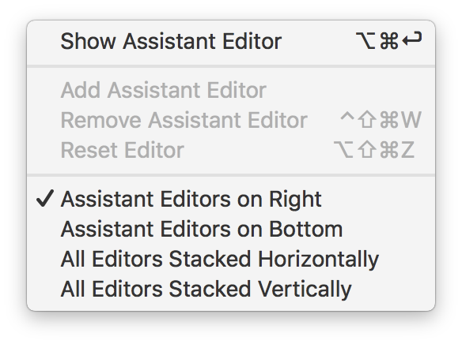

### 2.5.3 版本编辑器

版本编辑器(Version editor)在一个面板中展示当前选中文件,在第二个面板中展示该文 件的另一个版本,以便比较两者之间的差异,如图 2-18 所示。只有当你的工程支持源码控制的时候,该编辑器才起作用。

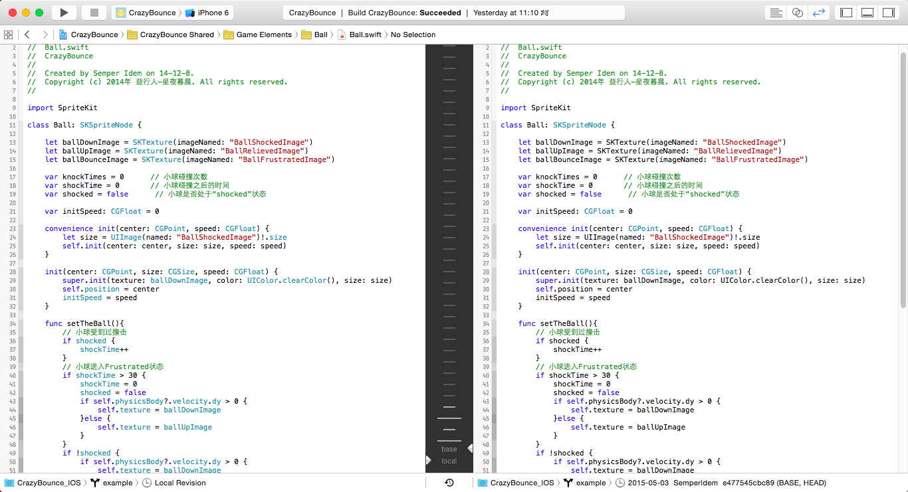

版本编辑器有三种显示模式,分别如下:

* **比较模式(Comparison)**是最常用也是默认的显示模式,通过这个模式可以进行不同 版本之间的代码比较工作。 
* **责任人模式(Blame)**是在第二个面板中显示提交信息和修改代码的对应,通过这个功能可以有效地寻找到提交优质或者劣质代码的人员,从而做出相应的反应。
* **日志模式(Log)**是在第二个面板中显示所有有记录的版本的提交信息。 

比较模式的版本编辑器有一个很有用的功能:时间线(Timeline),通过时间线功能,我们可以回溯到有记录的时间段,选择相应的版本,来对代码之间进行比较。

时间线功能位于版本编辑器正下方,以一个小小的钟表形式显现。点击这个按钮,就 会在版本编辑器的中央分隔区域显示一条黑色的时间线。通过将鼠标在时间线上下滑动,就可以浏览所有可用的版本。

时间线是按照时间顺序排列的,越新的版本就越靠下面。灰白色长实线则是将可用版本进行分组,更新不超过 24 小时的版本将会被长实线分隔为一组。 

可用的版本将会以灰白色短实线表示,鼠标移到实线上面,会显示出版本的时间、描述等信息,如图 2-19 所示。

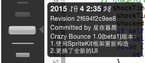

当你找到所需的版本之后,单击这个版本就可以在相应的版本编辑器中显示对应版本的代码了。

关闭时间线,就可以对比各版本之间的不同了。不同的区域用与背景色相似的颜色框起来,并且在中间予以连接和显示,中间的按钮还会显示不同之处的序号。点击序号可以选择“ Discard changes”,以恢复原来版本的配置情况。

## 2.6 调试区域

当应用运行的时候,Xcode 会开启调试功能。你可以使用图形化的工具直接在代码编辑器中调试应用,这时候,一些调试功能都会在调试区域中进行,调试区域如图 2-20 所示。

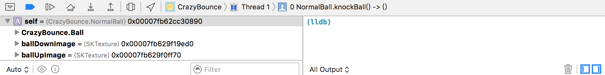

调试区域可以用来控制程序的执行,比如执行断点、位置模拟等,调试区域还可以用来输出`NSLog`、`print`等命令控制行输出语句。

关于调试区域的更多内容,会在第 11 章进行更为详细的介绍。

## 2.7 工具区域

工具区域位于工作区窗口(见图2-1)的最右边,你可以通过它快速访问很多资源，如图 2-21 所示,下面分别介绍:

* 检查器(inspectors),用以查看和更改编辑器中选中元素的属性和相关特性。
* 现有的资源库,用来方便快捷地添加文件、代码片段、控件以及资源文件等。

与编辑器区域一样,工具区域也是会根据环境的不同而进行相应的变化。通常情况下,你通常会在检查器导航栏上看见两个检查器:文件检查器和快速帮助检查器。下面简介一下这两个检查器。

* **文件检查器(File inspector)**:用以查看和管理选中文件的元数据。尤其是要进行本地 化故事板和其他媒体文件,并更改用户界面文件设置操作的时候。

* **快速帮助检查器(Quick Help inspector)**:用以查看元素的帮助信息。比如对方法的简 明描述,该方法何时在何处被声明,该方法的范围、所需的参数、适用平台和可用的 架构等。

使用库导航栏则可以访问现有的资源库,资源库有如下一些:

* **文件模板(File templates)**:拥有默认代码结构的文件模板,关于文件模板的更多内容, 请参阅本书附录 C.1“文件模板”。
* **代码片段(Code snippets)**:用于存储经常用到的源代码片段,比如说类声明、闭包等等。关于代码片段的更多内容,请参阅本书附录A.2“代码片段”。 
* **对象(Objects)**:应用的用户界面的控件库,有关控件对象的更多内容,请参阅本书附录 C.4“控件模板”。 
* **媒体(Media)**:包含图形、图标、声音文件以及诸如此类的文件。

想要在你的项目中使用现有的库,可将其直接拖拽至适当的区域。比如,你要使用代码片段,可将其从库中直接拖放到源码编辑器中;想要使用文件模板创建一个源码文件,可将其模板拖放至项目导航器中。

想要限制某个库的项目,可在搜索栏的文本域输入相关的文本进行限制。比如,输入 “ button ”便可展示对象库中的所有按钮。

## 2.8 标签页
Xcode 和 Safari 一样,可以使用“标签页”来在同一个工作区窗口中,打开多个不同的项目文件,如图 2-22 所示。

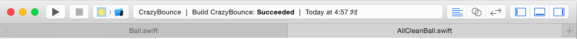

要创建一个新的标签页,从标题栏中依次选择 File → New → Tab,即可完成创建。开发者可以随意拖动标签页以重新排定顺序。也可以双击标签页的标题,来修改当前文件的名称。 

要关闭标签页,单击标签页上的关闭按钮即可,或者从标题栏中选择 File → Close Tab 完成关 闭操作。

> 提示 
> 
> 可以使用快捷键来快速对标签页进行操作。比如,“ Command + T”创建一个新的选 项卡,“ Command + W”关闭当前选项卡,“ Command + { 或 }”用于切换前一个 / 后 一个选项卡。

所谓“读书破万卷,下笔如有神”,对于法宝、武功等都是同样的道理。只有掌握了其基本用法,打好基础,方能直上青云,修为小成。

如此道理,无论对于修道、修学,还是技巧来说,都是一样的。熟能生巧,古有老翁滴油穿币,今有巧工善事利器。正可谓:

***闻百徵,操千曲,晓声引雀音绕梁。闻鸡舞,凿壁光, 业精于勤无人当。***