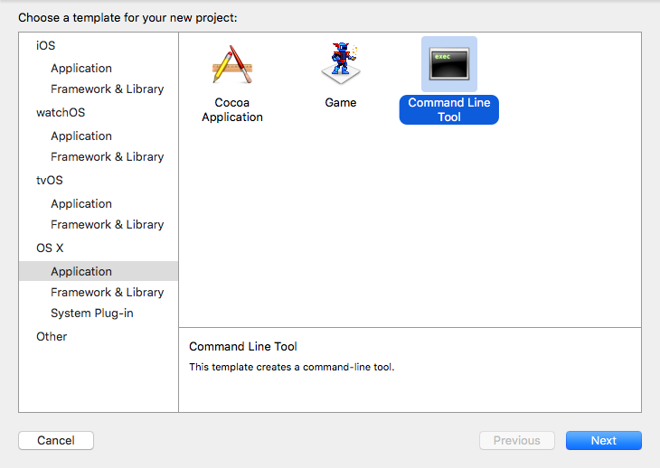

# 第1章 小试牛刀 - Xcode初体验

忆往初,谈笑中多少情仇恩怨;道不尽,生死间几许红尘缱绻。

世人常言,人在江湖,身不由己。但江湖之外何尝能体会到江湖中人的快乐?正有这样 一位少年良辰,年方弱冠,便毅然决然地踏入了编程江湖。年少之志,意气风发,欲挥斥方遒。试问哪位初入编程江湖之人的梦想或一生浪迹天涯,或成就一番功名,随后有朝一日其风流往事在某个小茶馆被小老儿这般人物评说。诸君可是这样认为的?

初入江湖,首先就是要有一把趁手的兵器,恰逢苹果帮新推出了 Swif t 这样一门简单、 强大的内功心法,极大地降低了入门的难度,于是良辰便决心踏上了修炼 Xcode 之路。经过 一番打听,他来到了岚风谷......

## 1.1 下载 Xcode

九月叶下,岚风谷。一位执剑侠客正立于少年面前,默然片刻,云:

既然你已拜入我帮门下,从今天起,就由我来教导你。看样子你已经初步掌握了 Swift 这门内功,不过,掌握了内功并不意味着你能够成为一名真正的编程侠客。试想,空有一身内力,没有武器,没有功法,很可能你连一只鸡都杀不了。因此, 你就必须要牢牢掌握好 Xcode这个极其有用的法宝,这也是本帮推荐帮众使用的唯一一件法宝。有了它,你才可能成为一名仗剑天涯的编程侠客。

你首先检查一下自己的身体素质吧!要掌握 Xcode这件法宝,还是有硬性要求的。如果根基不足,强行使用,轻则不成大器,重则伤筋断骨,有性命之忧。如果根骨不行,那就选择早一些版本的 Xcode 来使用。

> Xcode 7.1 目前要求：
> * Xcode 7.1需要运行在OS X Yosemite(10.10.5)及其以上版本
> * 硬盘至少余留8G以上的硬盘空间，当然越多越好
> * 至少需要4G以上内存，才能够比较流畅地运行Xcode
> * 如果您正在使用 OS X Mavericks(10.10.9)或者更老的版本 ，请考虑升级到最新的Yosemite以获取更加优秀的体验，或者使用 Xcode 6或者更早的版本
> * Xcode 7 最低支持 OS X Tiger(10.4)、iOS 6.0、watchOS 1以及 tvOS1版本的SDK。如果您打算使用更早版本的 SDK，请使用装有旧系统以及老版本的Xcode 的Mac，您或许会考虑尝试将这些SDK放入到Xcode 7当中，但是很遗憾这个操作基本是无法成功的，因为它们对应的编译器以及运行时都不再被支持

Xcode这件法宝则能够帮助像你这样的“江湖菜鸟”迅速成长为“编程侠客”，它是一个十分强大的工具，而且自身集成了许多好用、强大的武器，如何完全掌握这些武器，就是你今后所需要下苦功进行学习的。那么对于你来说，应该从哪儿搞到Xcode这件威力十足的法宝呢？

最好的办法就是前往我帮专门设立的Mac App Store当中购买，我帮要求购买Xcode的人必须拥有其Apple ID，以证明其身份。当然，它是完全免费的。不过在等待入手的过程当中你可以去找个地喝杯茶，因为Xcode太大了，从总部调配过来需要很长时间。有些时候，由于某些原因，苹果官方的押运速度会非常的慢，这点你可能清楚。

如果觉得押运速度过于缓慢的话，还可以前往https://developer.apple.com/downloads/ 下载我帮官方提供的.dmg 文件进行安装。

> **警告**
> 
> 2015年9月，国内爆出“XcodeGhost”事件，这是一种第三方病毒感染方式，主要通过非官方下载的 Xcode 传播，能够在开发过程中通过 CoreService库文件进行传染，使编译出的 App 被注入第三方代码，向指定服务器上传用户数据。因此，我们不推荐大家使用第三方下载的方式，截止2015年11月，XcodeGhost 的影响仍未过去。

## 1.2 苹果开发者计划

可以说，当你开始使用Xcode的时候，就可以称呼自己为“苹果开发者”了，这也正是外界对于我帮帮众所给予的称号。不过，我帮并不会为普通帮众给予很多关注，只有交了供奉的帮众，才能成为“精英”，受到我帮的诸多优待。

加入开发者计划的方式可能会发生变化，不过如果你打算加入的话，我可以给你先描绘一个大概。前往苹果开发者计划网站(https://developer.apple.com/cn/programs/ )，会有专人来指引你加入的。那么问题是，所谓的“优待”都有哪些呢？

* 我帮将会给精英提供最新的开发套件以供尝鲜，包括最新的操作系统和开发套件。
* 能够提供专门的支持服务。如果你在修炼方面遇到了困难，可以去联系我帮，会有大师来为你解答。
* 能够发布应用，意味着你就能够在苹果帮的官方商店里面销售各种东西。

目前，我帮的开发者计划面向于所有的苹果平台设备，包括iPhone、iPad、iPod、Mac、Apple Watch和 Apple TV，也就是说，加入了开发者计划，就能够在App Store里面分发App了，包括iOS上的App Store和Mac上的Mac App Store。此外，Safari扩展的分发权限也包含在里面。

稍安勿躁，看得出来你很关注其价格。我帮给出的价格仍然符合“高大上”情怀——688RMB，一年。没错，不要998，只要688，开发者计划带回家。

因此，你在考虑加入开发者计划之前，为何不先将Xcode练习到炉火纯青？这样就不会浪费手中的大洋了，当然如果你觉得自己财大气粗的话，就当我没说这句话。

当你在选择开发者计划的时候，要注意是选择以个人的身份还是以公司的身份发布应用。如果是后者，那么还需要向我帮提交一系列的文档证明才能完成申请，比如说法人实体名称和D-U-N-S码等等。具体的操作，在此我就不再赘述了，我帮对此有着详细的指南。

## 1.3 欢迎界面

就先让你一睹Xcode的风采吧。如你所见，Xcode的表体是一张蓝色的卷轴，上面有一把精致的银锤，这正是代表了我们“开发者”的标志所在。你要记住，我帮的宗旨是，我们“苹果开发者”所制作的东西，都是能让公众受益的，并且，我们都以公众喜爱我们的产品为荣。这种精神，我谓之“天志”，就如轮人之有规，匠人之有矩。好的，毋需多言，让我们打开它来一探究竟，首先出现的是Xcode的欢迎界面，如图1-1所示：

界面的左侧有三个选项，这是用来建立和导入项目的，第一个是使用playground来开始项目，它能够帮助我们实现最新、最炫的想法；第二个是创建Xcode项目，这也是正常情况下创建项目开始的地方；第三个是从代码库下载代码，可以从代码库中直接下载到本地的Xcode中来进行运行或修改，往往用于版本管理和多人协作。

界面右侧是项目列表，上面列举了最近使用过的项目，方便快速打开常用的项目。如果要打开的项目不在这个列表里面，那么可以点击列表最下方的“Open another project…”来打开项目。

如果不想再看到这个欢迎界面的话，那么就把最下方的“Show this windows when Xcode launches”的复选框取消掉，这样再打开Xcode的时候欢迎界面就不会再出现了。

若要再次打开Xcode欢迎界面，那么依次选择菜单栏上的“Window -> Welcome to Xcode”即可，或者直接使用“Command + Shift + 1”快捷键。

## 1.4 认识 Playground

什么是Playground？我更愿意称呼其为“训练场”。在这里，可以尽情地使用Swift这门功法来施展各式各样的招式，既可以用来练习Swift，也可以用来实现某个功能然后将其融合到产品当中，还可以设计某一个算法然后观察它的显示结果。可以说，“训练场”让Swift展示了某些脚本语言的特性。图1-2显示了“训练场”的模样：

> 提示：
> 
> 实际上，Playground只是提供了一个可实时编译运行并展示的交互式开发环境而已，类似于著名的REPL。因此，Swift并不是一门解释型语言，仍然还是一门编译型语言，这项功能完全借助于强大的LLVM编译器的能力。不过，目前Playground仅仅只支持Swift语言，但是国外开发者Krzysztof Zabłocki开发出了一个可以运行Objective-C语言的Playground，感兴趣的读者可以前往他的[Github](https://github.com/ krzysztofzablocki/KZPlayground)上下载。

在界面的右侧区域，可以实时地看到常量、变量的值、打印的内容以及循环次数等等，这就是所谓的代码版的“所见即所得”。

将鼠标指向Playground中所显示出来的值，便可以看到界面右侧出现了一只小眼睛和一个白色的圆圈，如图所示。点击小眼睛，也就是所谓的“Quick Look（快速查看）”，就可以快速查看其完整的值。如图1-2所示，点击“快速查看”之后，从小眼睛的部位弹出了一个小对话框，对话框里面显示了该变量（常量或者结果）的值。

点击白色的圆圈，也就是所谓的“Show Result（显示结果）”就可以将对话框中显示的结果值嵌入到代码片段里面，如图1-3所示。这个功能大大地提升了Playground的可视化程度，变得更加有意思了。我们也可以再次点击白色圆圈，就可以将这个结果框从代码中移除了。

> 提示：
>
> 在 Xcode 6 的 Playground 当中，还可以在结果框的左上角点击”x”按钮关闭该结果框。

这里我们实现了一个循环次数为100次的循环结构，每次循环，i的值就自增1，然后用变量num来显示和记录这个值。单击快速查看或者是显示结果按钮，就会看到一个蓝色的“一次函数”，如图1-4所示。

这个是以时间为横坐标轴显示的图形，主要是显示在循环体当中，借助这个功能，可以轻松查看在循环过程中，变量值的变化情况。Xcode 6 中，在这个结果框的右上角还存在三个按钮，分别是让其显示图表（Gragh），还是显示当前值（Current Value），亦或者是显示全部的值，如图1-5所示。

对于 Xcode 7来说，这个选项变成了在结果框处点击右键，在弹出的对话框中选择结果该如何显示，如图1-6所示。

对于 Xcode 6 来说，Playground的下方默认是时间控制栏，通过它可以调整当前时间，只要是对受时间控制的函数、方法体有效。右下角则是指定Playground运行最高层（top-level）代码的时间。

在 Xcode 7 中取而代之的是另外两个东西，分别是控制台显示和 Playground 运行控制选项。Playground 运行控制选项可以选择停止和开始 Playground 的运行。至于时间控制栏，则需要其他的方法打开。

总之，Playground是一个很有意思的东西，用它来练习Swift是再好不过的了，不过Playground仍然有它的限制，比如说Playground无法释放内存、性能受到极大的限制等等问题。关于 Playground 的更多内容，我们将在未来的章节中对其专门进行介绍。

## 1.5 创建项目

好了，是时候离开“训练场”了，现在我们要创建第一个项目了。

（1）单击“Create a new Xcode project”,这时弹出一个“项目模板”选择窗口，如图1-8所示。有关“项目模板”的详细说明，请参阅本书的附录C.2“项目模板”。这里我们选择“Mac”——“Application”——“Command Line Tool”命令行工具模板，然后输入项目名称(Product Name)、组织名称(Organization Name)以及组织标识符(Organization Identifier)。

